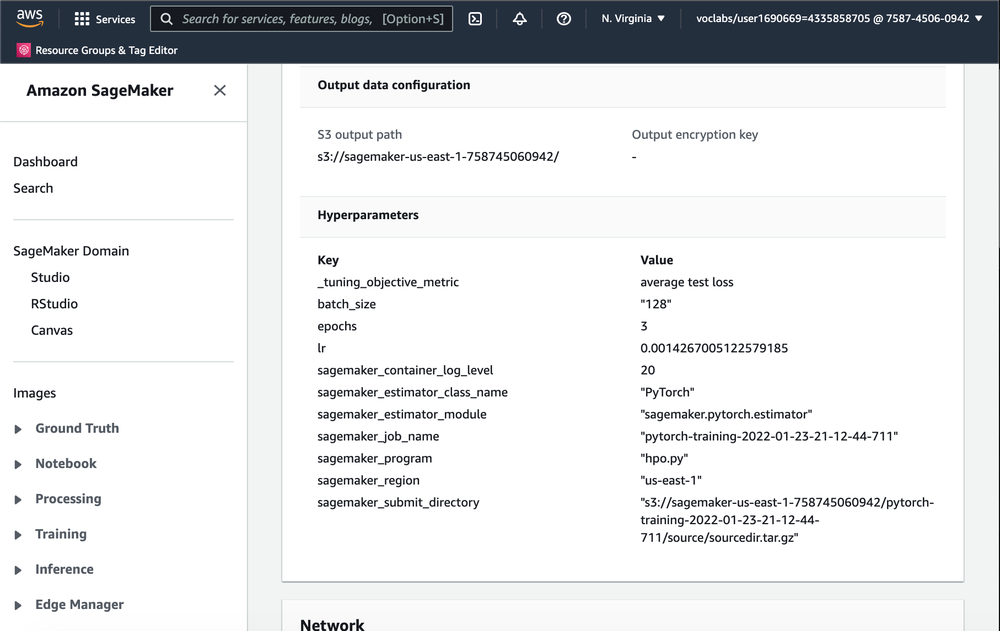

# Image Classification using AWS SageMaker

This project is part of AWS Machine Learning Engineer Nanodegree Program. It uses AWS Sagemaker to train a pretrained model that can perform image classification on dog breed images. Utilisng hyperparameter tuning, sagemaker dubugger and profiler, the most optimal model was deployed to an endpoint. 

The following has been carried out:
1. Project set up and installation. Downloaded and uploaded data to S3 to be accessed from Sagemaker. 
2. Selected a pre-trained CNN and trained the last layer with hyperparameter tuning.
3. Used the best parameters , re-trained the model with AWS Debugger and Profiler. 
4. Deployed the model to an endpoint. 

# Project Set Up and Installation
Enter AWS through the gateway in the course and open SageMaker Studio. Open Jupyter Notebook and start coding by installing dependencies. smdebug is a must installed module.

# Dataset
The provided dataset is the dogbreed classification dataset.

# Access
Upload the data to an S3 bucket through the AWS Gateway so that SageMaker has access to the data.

# Files
1. hpo.py: script used to run hyperparameter tuning.
2. train_model.py : use the best hyperamaters to train the model with debugger and profiler. 
3. endpoint.py: file needed to invoke and endpoint.

# Hyperparameter Tuning
Resnet18 pretrained model was chosen with fully connected layers to classify the breeds of dogs. This model is not as deep as other ResNet models but still able to classify up to 1000 images. We believe it would train faster and provide good results for our 133 classsificatino problem.

Furthermore, we optimised the parameters on:
learning rate: a continuous range from 0.001 to 0.1.
batch size : choosing from 64,128,256 , 512
epochs: an integer range from 2,3,4

This shows the hyperparameter job completed.

This shows hyperparameters selected.

This shows cloudwatch logs for the job.

# Debugging and Profiling
Debugger helps us understand what is happening when the model is training, identifying if there are issues specifically with vanishing gradients, overfitting and the loss not decreasing. Profiler helps us check how well out model is training and inspect CPU/GPU utilisation , CPU/GPU memory utilisation aswell as instance metrics. This has been perfomed by adding debugger and profiler hooks into the training script. 

Results
From debugger we can view the cross entropy loss:

This shows CPU utiisation from the profiler report. The full report is included in the repository. It shows good CPU utilisation for the training as GPU was not available. 

The profiler report originally saved in S3, can be found [here](ProfilerReport/profiler-output/profiler-report.html).

## Model Deployment
The model has been deployed to an endpoint , the instance that it is running on is `ml.m5.large` which is cheap and has sufficient compute power for testing purposes. 

To invoke the endpoint, test images should be uploaded to the same repository as the notebook. The image must be converted to bytes and then passed to the estimator. The response of the estimator is an 133 length array , corresponding to the likelihood for each class. To find the predicted class we look at the argmax of the array. 

Here is an image of the deployed endpoint

Thank you for reading . 